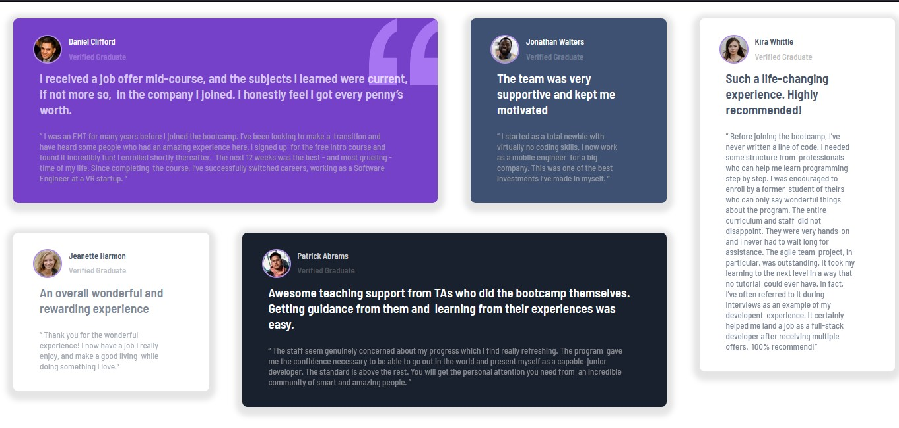

# Frontend Mentor - Testimonials grid section solution

This is a solution to the [Testimonials grid section challenge on Frontend Mentor](https://www.frontendmentor.io/challenges/testimonials-grid-section-Nnw6J7Un7). Frontend Mentor challenges help you improve your coding skills by building realistic projects. 

## Table of contents

- [Overview](#overview)
  - [The challenge](#the-challenge)
  - [Screenshot](#screenshot)
  - [Links](#links)
- [My process](#my-process)
  - [Built with](#built-with)
  - [What I learned](#what-i-learned)
  - [Continued development](#continued-development)
  - [Useful resources](#useful-resources)
- [Author](#author)
- [Acknowledgments](#acknowledgments)

## Overview

### The challenge

Users should be able to:

- View the optimal layout for the site depending on their device's screen size

### Screenshot

### Links

- Solution URL: [Add solution URL here](https://github.com/Ajaya-Rajbhandari/testimonials-grid-sector)
- Live Site URL: [Add live site URL here](https://testimonials-grid-sector.vercel.app)

## My process

### Built with

- Semantic HTML5 markup
- CSS custom properties
- Flexbox
- CSS Grid
- Mobile-first workflow
- [React](https://reactjs.org/) - JS library

### What I learned

I learn about the grid layout and how to arrange element in that grid layout. This Project took me more than 2 weeks to finish. I Followed mobile first approach, It was easy this way to create this project.

### Continued development

I would still want to focus on the way that my layout is displayed in desktop.
I would like to get help in this part where my card component not occupying it's full area in desktop mode.

### Useful resources
-I used AI like blackbox and ChatGPT to understand about grid layout.

## Author

- Website - [Ajaya Rajbhandari](https://ajaya-rajbhandari.vercel.app)
- Frontend Mentor - [@Ajaya-Rajbhandari](https://www.frontendmentor.io/profile/Ajaya-Rajbhandari)
- Twitter - [@AJaya521](https://www.twitter.com/Ajaya521)

## Acknowledgments

I would like to thank my family for their support and encouragement. I would also like to thank the
Frontend Mentor community for their help and guidance. 

